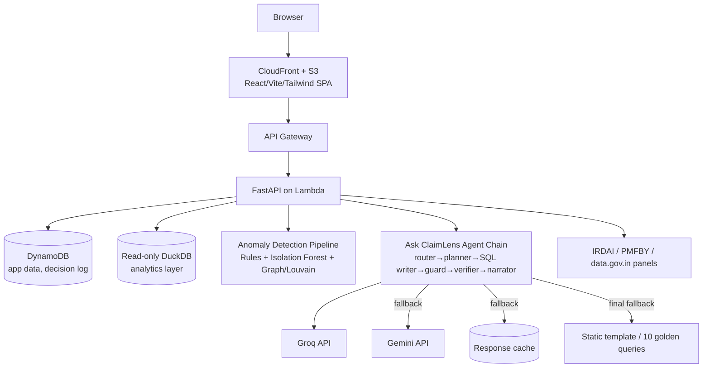
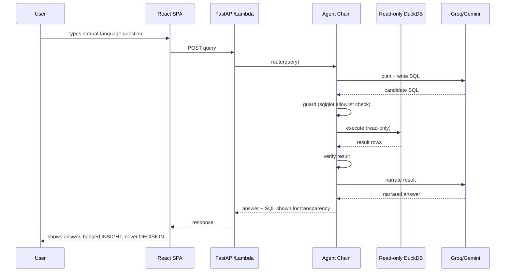
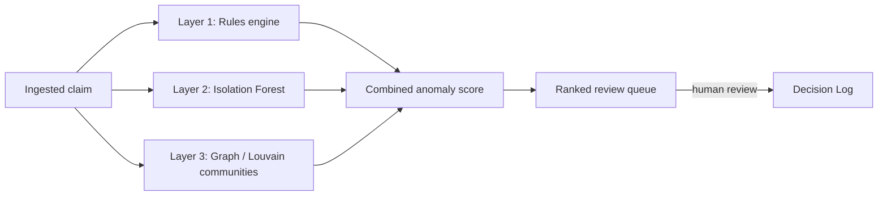

# ARCHITECTURE.md

## Architecture overview
ClaimLens Nexus is a single-page React app served from S3/CloudFront, talking to a FastAPI backend running on Lambda, backed by DynamoDB for application data and a read-only DuckDB analytics layer for the NL-to-SQL agent. Anomaly detection runs as a batch/pipeline process (rules + Isolation Forest + graph/Louvain) over ingested synthetic data. External context comes from IRDAI/PMFBY panels. LLM calls route through a fallback chain (Groq → Gemini → cache → static template) to survive free-tier rate limits during a live demo.

## Component architecture

## Data flow — Ask ClaimLens request

## Anomaly detection flow (three layers)

## Authentication flow
`PENDING — requires original plan.` No auth mechanism was specified in the source material.

## Deployment flow
See [DEPLOYMENT.md](./DEPLOYMENT.md) for the full AWS build order and the Lambda Function URL permissions gotcha.

## Development vs. production environment
`PENDING — requires original plan` for exact environment-variable and local-dev setup. Known constraint: AWS free-tier ceilings apply to production; local development should not assume unlimited LLM calls given Groq/Gemini rate limits.

## Failure scenarios (known, from verification pass)
- Groq daily/per-minute quota exhausted mid-demo → must fall back to Gemini → cache → static template without visibly breaking
- Gemini model ID stale/retired → agent chain fails outright unless model ID is reconfirmed at build time
- Lambda Function URL returns 403 → missing one of two required IAM permissions
- New AWS account flagged for manual review → account unusable for hours; no AWS-compliant fallback currently documented (see KNOWN_ISSUES_RISKS.md item C)

## Scalability considerations
Not a stated requirement for this hackathon submission; free-tier ceilings are the binding constraint, not scale. See [COST_PLAN.md](./COST_PLAN.md).

## Security boundaries
- DuckDB analytics layer is read-only with external access disabled (hardened execution)
- SQL agent output is filtered through a sqlglot allowlist before execution
- Lambda's own sandbox provides an additional isolation layer
This is a genuine defense-in-depth pattern per DuckDB's own published security guidance, not overkill for an LLM-generated-SQL surface — see [AI_ML.md](./AI_ML.md).
