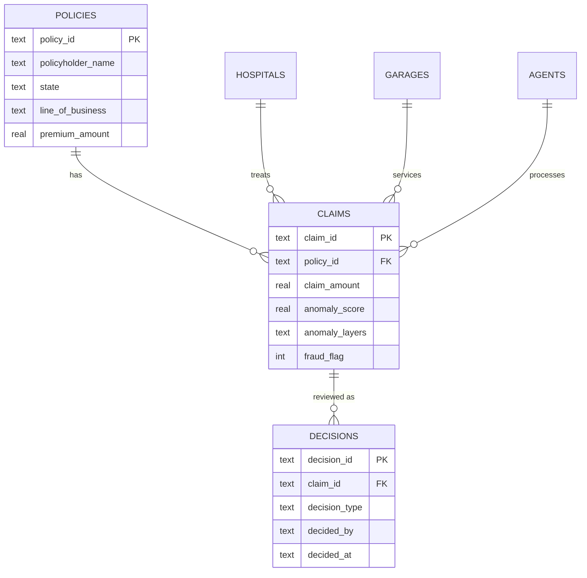

# DATABASE.md — ClaimLens Nexus Schema & Architecture

## Dual-Database Architecture

```
SQLite (claimlens.db)          DuckDB (analytics.duckdb)
├── Operational store           ├── Read-only analytics layer
├── Handles writes (decisions)  ├── No writes post-load
├── WAL mode, FK enforcement    ├── External access DISABLED
└── 6 tables                    └── Mirror of all 6 tables
```

**Why two databases?** Per ADR-002:
- DuckDB provides fast analytical queries for the NL-to-SQL agent chain
- DuckDB is opened read-only with external access disabled (security hardening)
- SQLite handles transactional writes (decision log) with instant visibility
- DuckDB data is reloaded from SQLite at server startup and after anomaly detection

---

## Tables

### `policies`
| Column | Type | Constraints | Description |
|--------|------|-------------|-------------|
| policy_id | TEXT | PRIMARY KEY | Unique policy identifier (e.g., "POL-00001") |
| policyholder_name | TEXT | NOT NULL | Name of the policyholder |
| state | TEXT | NOT NULL | Indian state |
| line_of_business | TEXT | NOT NULL | Health, Motor, Property, Life, Crop |
| insurer | TEXT | NOT NULL | Insurance company name |
| premium_amount | REAL | NOT NULL | Annual premium in ₹ |
| start_date | TEXT | NOT NULL | ISO date string |
| end_date | TEXT | NOT NULL | ISO date string |
| status | TEXT | NOT NULL, DEFAULT 'Active' | Active, Expired, Cancelled |

**Indexes:** `idx_policies_state(state)`, `idx_policies_lob(line_of_business)`

### `claims`
| Column | Type | Constraints | Description |
|--------|------|-------------|-------------|
| claim_id | TEXT | PRIMARY KEY | Unique claim identifier (e.g., "CLM-00001") |
| policy_id | TEXT | NOT NULL, FK→policies | Parent policy |
| claim_amount | REAL | NOT NULL | Claimed amount in ₹ |
| claim_date | TEXT | NOT NULL | ISO date string |
| settlement_amount | REAL | NULLABLE | Settled amount, if resolved |
| settlement_date | TEXT | NULLABLE | Settlement date |
| status | TEXT | NOT NULL, DEFAULT 'Pending' | Pending, Approved, Rejected, Under Investigation |
| hospital_id | TEXT | NULLABLE | FK reference (not enforced) |
| garage_id | TEXT | NULLABLE | FK reference (not enforced) |
| agent_id | TEXT | NULLABLE | FK reference (not enforced) |
| claim_type | TEXT | NOT NULL | Cashless, Reimbursement, Third-Party |
| fraud_flag | INTEGER | NOT NULL, DEFAULT 0 | 1 = synthetic fraud label |
| anomaly_score | REAL | DEFAULT 0.0 | Combined 3-layer anomaly score |
| anomaly_layers | TEXT | DEFAULT '{}' | JSON: per-layer scores and reasons |

**Indexes:** `idx_claims_policy(policy_id)`, `idx_claims_status(status)`, `idx_claims_date(claim_date)`, `idx_claims_anomaly(anomaly_score DESC)`

### `hospitals`
| Column | Type | Constraints | Description |
|--------|------|-------------|-------------|
| hospital_id | TEXT | PRIMARY KEY | Unique hospital ID |
| name | TEXT | NOT NULL | Hospital name |
| city | TEXT | NOT NULL | City |
| state | TEXT | NOT NULL | State |
| tpa_network | TEXT | NULLABLE | TPA network affiliation |
| bed_count | INTEGER | NULLABLE | Number of beds |

### `garages`
| Column | Type | Constraints | Description |
|--------|------|-------------|-------------|
| garage_id | TEXT | PRIMARY KEY | Unique garage ID |
| name | TEXT | NOT NULL | Garage name |
| city | TEXT | NOT NULL | City |
| state | TEXT | NOT NULL | State |
| service_type | TEXT | NOT NULL | Authorized, Multi-brand |

### `agents`
| Column | Type | Constraints | Description |
|--------|------|-------------|-------------|
| agent_id | TEXT | PRIMARY KEY | Unique agent ID |
| name | TEXT | NOT NULL | Agent name |
| region | TEXT | NOT NULL | Operating region |
| commission_rate | REAL | NOT NULL | Commission percentage |
| active_policies_count | INTEGER | NOT NULL, DEFAULT 0 | Number of active policies |

### `decisions`
| Column | Type | Constraints | Description |
|--------|------|-------------|-------------|
| decision_id | TEXT | PRIMARY KEY | Unique decision ID (e.g., "DEC-A1B2C3D4") |
| claim_id | TEXT | NOT NULL, FK→claims | Linked claim |
| insight_type | TEXT | NOT NULL | Anomaly, Pattern, Ring |
| decision_type | TEXT | NOT NULL | Investigate, Escalate, Dismiss, Approve |
| decided_by | TEXT | NOT NULL | User/role who decided |
| decided_at | TEXT | NOT NULL | ISO datetime string |
| rationale | TEXT | NULLABLE | Human-provided reasoning |

**Indexes:** `idx_decisions_claim(claim_id)`

---

## Entity-Relationship Diagram



---

## Data Lifecycle

1. **Startup**: `init_sqlite()` creates tables if they don't exist
2. **Data Load**: `ensure_data_loaded()` generates synthetic data (5k policies, 8k claims) if the DB is empty
3. **Anomaly Detection**: `run_full_detection_pipeline()` scores all claims and writes `anomaly_score` + `anomaly_layers`
4. **DuckDB Sync**: `init_duckdb_from_sqlite()` copies all 6 tables to DuckDB for read-only analytics
5. **Runtime**: Writes go to SQLite (decisions); reads go to DuckDB (analytics) or SQLite (decisions)

## Synthetic Data Volumes
| Entity | Count | Config |
|--------|-------|--------|
| Policies | 5,000 | `SYNTHETIC_POLICIES_COUNT` |
| Claims | 8,000 | `SYNTHETIC_CLAIMS_COUNT` |
| Hospitals | 200 | `SYNTHETIC_HOSPITALS_COUNT` |
| Garages | 150 | `SYNTHETIC_GARAGES_COUNT` |
| Agents | 100 | `SYNTHETIC_AGENTS_COUNT` |
| Fraud rate | ~5% | Calibrated to IRDAI data |

---

## Security Notes
- DuckDB is opened **read-only** after data loading (`read_only=True`)
- External access is **disabled** (`SET enable_external_access = false`)
- All LLM-generated SQL passes through the sqlglot allowlist guard before execution
- See [AUTH_SECURITY.md](./AUTH_SECURITY.md) for the full defense-in-depth architecture
